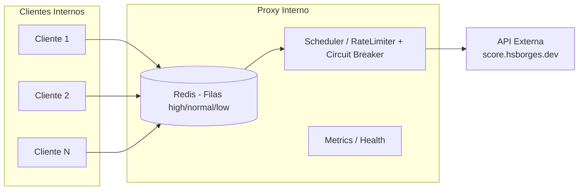

# 🛡️ Desafio — Proxy Interno

📚 **Trabalho de TADS — Engenharia de Software**  
🎓 **Universidade Federal de Mato Grosso do Sul (UFMS)**  
👨‍🎓 Acadêmico: **Fábio Ramos**

---

Projeto de proxy interno para consumir a API pública de score, respeitando rate limit externo e expondo métricas e logs para auditoria.

Resumo
- Rate limit externo: 1 req/s (penalidade +2s em caso de violação).
- Objetivo: absorver picos internos, minimizar penalidades e expor observabilidade.
- Endpoints: `/proxy/score`, `/metrics`, `/health`, `/api-docs` (Swagger).

Arquitetura


Decisões de design e padrões
- Fila em Redis com prioridades (high/normal/low) e TTL por job.
- Preempção quando cheia: high remove low/normal; normal remove low; low descarta.
- Scheduler com cadência dinâmica e circuit breaker (fechado/meia‑abertura/aberto) com timeout configurável.
- Observabilidade: prom-client (métricas), Winston (logs JSON), dashboards Grafana.
- Separação de camadas: API (controllers), services (fila), jobs (scheduler), utils (logger).
- Config via .env com defaults sensatos (12‑factor style).

Como rodar
Pré-requisitos
- Docker e Docker Compose (recomendado) ou Node 18+ e Redis 7+

Com Docker Compose
```bash
docker compose up --build -d
# Proxy: http://localhost:3000
# Swagger: http://localhost:3000/api-docs
# Prometheus: http://localhost:9090
# Grafana: http://localhost:3001
```

Local (Node + Redis)
```bash
npm install
export REDIS_HOST=127.0.0.1 REDIS_PORT=6379
npm start
```

Variáveis de ambiente (principais)
- UPSTREAM_URL: URL da API externa (default: https://score.hsborges.dev/api/score)
- QUEUE_MAX_SIZE: capacidade total da fila (default: 100)
- JOB_TTL_MS: TTL do job na fila (ms, default: 10000)
- REQUEST_TIMEOUT_MS: timeout por chamada ao upstream (ms, default: 3000)
- BREAKER_FAILURE_THRESHOLD: falhas para abrir o breaker (default: 3)
- BREAKER_OPEN_WINDOW_MS: janela com breaker aberto (ms, default: 10000)
- SCHEDULER_INITIAL_INTERVAL_MS: intervalo inicial do scheduler (ms, default: 1000)
- REDIS_HOST / REDIS_PORT: conexão Redis (em Compose, `redis` / `6379`)

Seed de testes
- Testes usam Redis e mocks de axios; execute:
```bash
npx jest --runInBand
```

Endpoints e exemplos
- GET `/proxy/score` — enfileira requisição para upstream (aceita `cpf` válido)
  - curl:
    ```bash
    curl "http://localhost:3000/proxy/score?cpf=05227892180"
    ```
  - Respostas: `202 Accepted` com `{ jobId }`; `400` inválido; `503` fila cheia.

- GET `/metrics` — métricas Prometheus
  - curl: `curl -H "Accept: text/plain" http://localhost:3000/metrics`

- GET `/health` — healthcheck
  - curl: `curl http://localhost:3000/health`

- GET `/api-docs` — Swagger UI

Observabilidade (principais métricas)
- proxy_queue_size; proxy_jobs_total{status}; proxy_job_latency_seconds
- proxy_penalties_avoided_total; proxy_scheduler_interval_ms
- proxy_rate_limit_penalties_total; proxy_timeouts_total
- proxy_upstream_errors_total{code}; proxy_fallbacks_total{motivo}
- proxy_circuit_state; proxy_circuit_open_total/close_total/half_open_total

Referências
- docs/guia.md — guia do projeto
- docs/fila_do_proxy.md — explicação da fila do proxy

