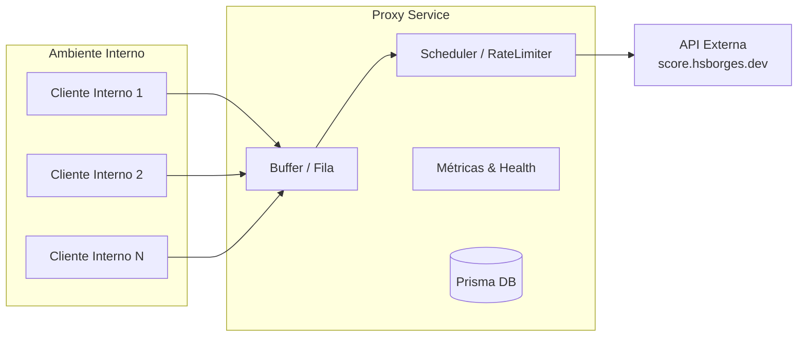

# 🛡️ Desafio — Proxy Interno

📚 **Trabalho de TADS — Engenharia de Software**  
🎓 **Universidade Federal de Mato Grosso do Sul (UFMS)**  
👨‍🎓 Acadêmico: **Fábio Ramos**

---

## 📌 Contexto

Este projeto consiste em criar um **proxy interno** para consumir a API pública  
[`https://score.hsborges.dev/docs`](https://score.hsborges.dev/docs).  

O proxy deve lidar com **rate limiting** imposto pelo provedor externo:

- ⏱️ **Rate limit externo:** 1 requisição por segundo.  
- ⚠️ **Penalidade:** +2 segundos ao violar o limite.  
- 🎯 **Objetivo:** lidar com picos internos, **minimizar penalidades** e **expor métricas**.  
- 📑 **Swagger**: utilizado para **documentar e testar os endpoints**.

---

## ✅ Requisitos Funcionais

- `GET /proxy/score` → encaminhar requisições.  
- `GET /metrics` → expor métricas de uso.  
- `GET /health` → healthcheck (liveness/readiness).  

---

## ⚙️ Requisitos Não Funcionais

- Suportar rajadas de até **20 req/s**.  
- Evitar penalidades recorrentes.  
- Throughput próximo de **1 req/s estável**.  
- Logs, métricas e dashboards para monitoramento.  

---

## 🏗️ Arquitetura

- **Proxy Service** com fila interna (backpressure).  
- **Scheduler** garante emissão máxima de **1 req/s**.  
- **Políticas de fila**: FIFO, prioridade, TTL.  
- **Fallback**: cache, shed load.  
- **Observabilidade**: métricas, logs estruturados e dashboards.  

---

## 📊 Estrutura do Sistema



## Decisões de Design e Padrões Utilizados

- **Express** para API HTTP.
- **Redis** para fila (buffer) e cache (opcional).
- **Prisma** como ORM, Singleton para conexão.
- **prom-client** para métricas Prometheus.
- **Swagger (OpenAPI)** para documentação automática.
- **Winston** para logs estruturados.
- **Padrão Singleton** para Prisma e Redis.
- **Separação de responsabilidades**: controllers, services, jobs, middlewares.
- **Scheduler** com rate limit (1 req/s) e penalidade.
- **Política de fila FIFO** (pode ser expandida para prioridade/TTL).
- **Fallback**: shed load ou cache se fila crescer demais.

## Como Rodar

### Pré-requisitos
- Node.js >= 18
- Redis (local ou Docker)
- (Opcional) Docker Compose

### Variáveis de Ambiente (.env)
```
PORT=3000
REDIS_URL=redis://localhost:6379
DATABASE_URL="file:./dev.db"
```

### Subindo com Docker Compose
```yaml
version: '3.8'
services:
    redis:
        image: redis:7
        ports:
            - "6379:6379"
    proxy:
        build: .
        ports:
            - "3000:3000"
        env_file:
            - .env
        depends_on:
            - redis
```

### Rodando Localmente
```sh
npm install
npx prisma migrate dev --name init
npm start
# ou com nodemon
npx nodemon src/index.js
```

### Seed de Testes
Implemente seeds em `prisma/seed.js` e rode:
```sh
npx prisma db seed
```

## Endpoints Internos

### 1. Enfileirar requisição para o upstream
**GET /proxy/score**

Exemplo:
```sh
curl "http://localhost:3000/proxy/score?cpf=12345678900&nome=Joao"
```
Resposta:
```json
{
    "message": "Requisição enfileirada",
    "jobId": 1
}
```

### 2. Métricas Prometheus
**GET /metrics**

Exemplo:
```sh
curl http://localhost:3000/metrics
```

### 3. Healthcheck
**GET /health**

Exemplo:
```sh
curl http://localhost:3000/health
```
Resposta:
```json
{
    "status": "ok",
    "uptime": 123.45,
    "timestamp": "2025-09-09T12:34:56.789Z"
}
```

### 4. Swagger (Documentação Interativa)
**GET /api-docs**

Acesse no navegador: [http://localhost:3000/api-docs](http://localhost:3000/api-docs)

---

> Para exemplos de uso com Postman/Insomnia, importe a collection via Swagger em /api-docs.
