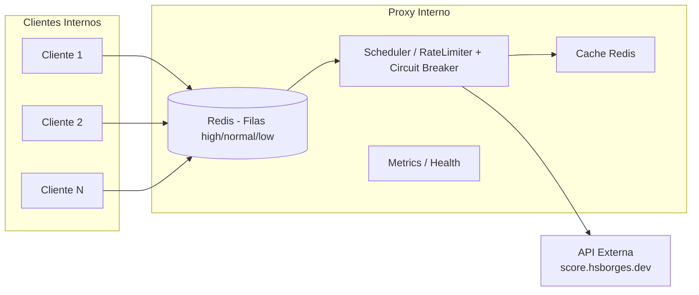

# 🛡️ Desafio — Proxy Interno

📚 **Técnicas Avançadas de Desenvolvimento de Software TADS — Engenharia de Software**  
🎓 **Universidade Federal de Mato Grosso do Sul (UFMS)**  
👨‍🎓 Acadêmico: **Fabio Ramos**

## Proxy Interno

Projeto de proxy interno desenvolvido para a disciplina de Engenharia de Software (TADS/UFMS), com foco em absorver picos de requisicoes ao upstream de score, evitar penalidades de rate limit e expor sinais de observabilidade.

## Resumo do Problema
- Rate limit imposto pelo provedor externo: 1 req/s (penalidade de +2s por violacao).
- Objetivo: desacoplar clientes internos da API externa, minimizar penalidades e manter auditoria.
- Funcionalidades principais: fila com prioridades, circuit breaker e **cache de respostas no Redis**.

## Arquitetura


## Padroes de Projeto
- **Proxy Pattern**: o endpoint `/proxy/score` enfileira requisicoes internas e o scheduler envia para o upstream na cadencia permitida.
- **Circuit Breaker**: estados fechado, meia-abertura e aberto controlam chamadas ao upstream em caso de falhas.
- **Cache-aside**: respostas recentes sao gravadas no Redis; consultas verificam primeiro o cache e servem miss/hit conforme configuracao (TTL ajustavel).

## Executando o Projeto
### Requisitos
- Docker e Docker Compose (recomendado) ou Node 18+ e Redis 7+.

### Docker Compose
```bash
docker compose up --build -d
# Proxy: http://localhost:3000
# Swagger: http://localhost:3000/api-docs
# Prometheus: http://localhost:9090
# Grafana: http://localhost:3001
```

### Modo desenvolvimento (nodemon)
O script de desenvolvimento utiliza `nodemon` para reiniciar o processo a cada alteracao em arquivos da pasta `src/`.
```bash
npm install
npm run dev
```
- Usa as variaveis de ambiente definidas no `.env`.
- Reinicia automaticamente quando um arquivo monitorado muda.

### Ambiente local (Node + Redis)
```bash
npm install
export REDIS_HOST=127.0.0.1 REDIS_PORT=6379
npm start
```
`npm start` tambem roda com `nodemon`, permitindo hot reload mesmo fora do script `dev`.

### Variaveis de Ambiente (principais)
- `UPSTREAM_URL`: URL da API externa (padrao: https://score.hsborges.dev/api/score)
- `QUEUE_MAX_SIZE`: capacidade da fila (padrao: 100)
- `JOB_TTL_MS`: TTL do job na fila, em ms (padrao: 10000)
- `REQUEST_TIMEOUT_MS`: timeout por chamada ao upstream, em ms (padrao: 3000)
- `BREAKER_FAILURE_THRESHOLD`: falhas seguidas para abrir o breaker (padrao: 3)
- `BREAKER_OPEN_WINDOW_MS`: tempo com breaker aberto, em ms (padrao: 10000)
- `SCHEDULER_INITIAL_INTERVAL_MS`: intervalo inicial do scheduler, em ms (padrao: 1000)
- `REDIS_HOST` / `REDIS_PORT`: conexao Redis (no Compose: `redis` / `6379`)
- `CACHE_TTL_SECONDS`: TTL do cache de respostas no Redis (padrao definido em `config.js`)

## Testes
Os testes utilizam Redis e mocks do axios.
```bash
npm test
# ou
npx jest --runInBand
```

## Endpoints Principais
- `GET /proxy/score`: enfileira a consulta de score. Responde `202` com `{ jobId }`, `400` para input invalido e `503` se a fila estiver cheia.
- `GET /metrics`: exporta metrics em formato Prometheus (`Content-Type: text/plain`).
- `GET /health`: healthcheck simples.
- `GET /api-docs`: interface Swagger gerada a partir de `src/config/swagger.json`.

## Observabilidade
- Metricas chave: `proxy_queue_size`, `proxy_jobs_total{status}`, `proxy_job_latency_seconds`, `proxy_circuit_state`, `proxy_rate_limit_penalties_total`, `proxy_fallbacks_total{motivo}`.
- Logs estruturados com Winston em JSON, voltados para integracao com stack de observabilidade.
## Documentacao Complementar

- [docs/relatorio_tecnico.md](docs/relatorio_tecnico.md): detalhamento tecnico completo do projeto.
- [docs/fila_do_proxy.md](docs/fila_do_proxy.md): funcionamento da fila com prioridades e politicas de preempcao.
- [docs/guia.md](docs/guia.md): guia rapido de operacao e monitoramento.
- [docs/proxy_interno_resumo.md](docs/proxy_interno_resumo.md): resumo executivo do desafio.

