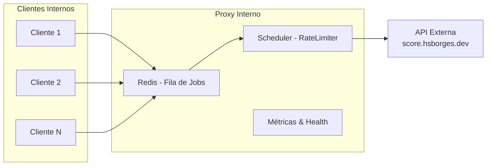

# 🛡️ Desafio — Proxy Interno

📚 **Trabalho de TADS — Engenharia de Software**  
🎓 **Universidade Federal de Mato Grosso do Sul (UFMS)**  
👨‍🎓 Acadêmico: **Fábio Ramos**

---

## 📌 Contexto

Este projeto consiste em criar um **proxy interno** para consumir a API pública  
[`https://score.hsborges.dev/docs`](https://score.hsborges.dev/docs).

O proxy precisa lidar com **rate limiting** imposto pelo provedor externo:

- ⏱️ **Rate limit externo:** 1 requisição por segundo.
- ⚠️ **Penalidade:** +2 segundos ao violar o limite.
- 🎯 **Objetivo:** absorver picos internos, minimizar penalidades e expor métricas de monitoramento.
- 📑 **Swagger**: utilizado para documentar e testar os endpoints internos.

---

## ✅ Requisitos Funcionais

- `GET /proxy/score` → encaminhar requisições ao upstream (aceita apenas **cpf**).
- `GET /metrics` → expor métricas para Prometheus.
- `GET /health` → healthcheck (liveness/readiness).

---

## ⚙️ Requisitos Não Funcionais

- Suportar rajadas de até **20 req/s**.
- Garantir throughput estável de **1 req/s** para o upstream.
- Evitar penalidades recorrentes.
- Logs estruturados, métricas detalhadas e dashboards.

---

## 🏗️ Arquitetura

- **Proxy Service** com fila no Redis (backpressure).
- **Scheduler** garante emissão máxima de **1 req/s**.
- **Fallback**: shed load (descartar requisições quando a fila encher) + resposta cacheada.
- **Observabilidade**: métricas Prometheus, logs estruturados (Winston) e dashboards Grafana.

---

## 📊 Estrutura do Sistema



## 🛠️ Tecnologias e Padrões

- **Express** → API HTTP.
- **Redis** → fila de requisições.
- **prom-client** → métricas Prometheus.
- **Swagger (OpenAPI)** → documentação da API.
- **Winston** → logs estruturados em JSON.
- **Padrão Singleton** → conexão Redis.
- **Separação de responsabilidades** → controllers, services e jobs.

## 🚀 Como Rodar

### Pré-requisitos

- **Node.js** versão 18 ou superior
- **Redis** (pode ser uma instância local ou executada via Docker)
- _(Opcional)_ **Prometheus** e **Grafana** para monitoramento e dashboards

## Rodando Localmente
```bash
npm install
npm start
# ou, para ambiente de desenvolvimento:
npm run dev
```

## 🔗 Endpoints Internos

### 1. Enfileirar requisição para o upstream

#### `GET /proxy/score`

Enfileira uma requisição para consulta de score no upstream, respeitando o rate limit externo.

**Parâmetros:**

| Nome | Tipo   | Obrigatório | Descrição                |
|------|--------|-------------|--------------------------|
| cpf  | string | Sim         | CPF (somente dígitos)    |

**Exemplo de requisição:**

```
GET /proxy/score?cpf=12345678901
```

**Respostas possíveis:**

- `200 OK`: Score retornado com sucesso.
- `400 Bad Request`: Parâmetro `cpf` ausente ou inválido.
- `429 Too Many Requests`: Fila cheia, requisição descartada.
- `500 Internal Server Error`: Erro interno ao processar.

**Observações:**  
- O endpoint aceita apenas CPFs válidos (apenas dígitos).
- Caso a fila esteja cheia, a requisição será descartada para evitar sobrecarga.


### 2. Métricas Prometheus

#### `GET /metrics`

Exibe métricas no formato Prometheus para monitoramento do proxy, fila, latência, taxa de erros e throughput.

**Exemplo de requisição:**
```
GET /metrics
```

**Resposta:**  
Conteúdo em texto no formato Prometheus.

---

### 3. Healthcheck

#### `GET /health`

Verifica o status de saúde do serviço (liveness/readiness).

**Exemplo de requisição:**
```
GET /health
```

**Resposta:**  
- `200 OK`: Serviço saudável.
- `503 Service Unavailable`: Algum componente indisponível.

---

### 4. Swagger (Documentação Interativa)

#### `GET /api-docs`

Acesse a documentação interativa dos endpoints via Swagger:

[http://localhost:3000/api-docs](http://localhost:3000/api-docs)

---

## 📊 Observabilidade

- **Prometheus** coleta métricas do endpoint `/metrics`.
- **Grafana** exibe dashboards para fila, taxa de erros e latência.
- **Logs JSON estruturados** permitem integração com ELK/Graylog.