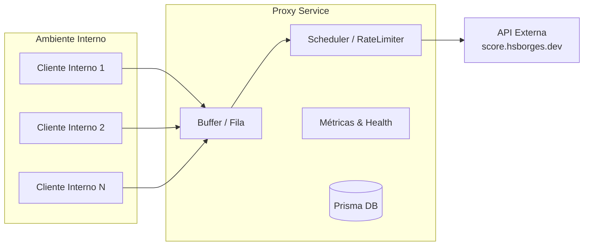

# Desafio --- Proxy Interno

## Contexto

Criar um serviço de **proxy interno** para consumir a API pública
`https://score.hsborges.dev/docs`.

-   Criar swwager para documentação
-   **Rate limit externo:** 1 req/s.\
-   **Penalidade:** +2s ao violar limite.\
-   **Objetivo:** lidar com picos internos, minimizar penalidades e
    expor métricas.

## Requisitos Funcionais

-   `GET /proxy/score`: encaminhar requisições.\
-   `GET /metrics`: expor métricas.\
-   `GET /health`: healthcheck.

## Requisitos Não Funcionais

-   Tolerar rajadas (20 req/s).\
-   Evitar penalidades recorrentes.\
-   Throughput próximo de 1 req/s.\
-   Logs, métricas e dashboards.

## Arquitetura

-   **Proxy Service** com fila interna (backpressure).\
-   **Scheduler**: libera no máx. 1 req/s.\
-   **Políticas de fila**: FIFO, prioridade, TTL.\
-   **Fallback**: cache, shed load.\
-   **Observabilidade**: métricas, logs estruturados.

## Estrutura

## Entregáveis

1.  Código-fonte com README e exemplos.\
2.  Relatório técnico curto.\
3.  Dashboard simples de métricas.\
4.  Testes automatizados (test harness).

## Critérios de Avaliação

-   Respeito ao rate limit.\
-   Qualidade da arquitetura.\
-   Confiabilidade e observabilidade.\
-   Desempenho sob carga.\
-   Clareza da documentação.
